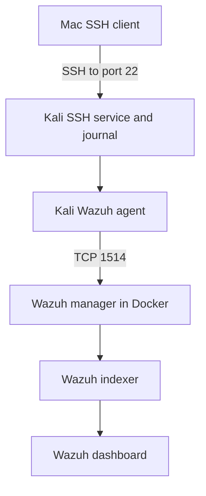

# Wazuh monitoring lab — September 26–30, 2026

This phase of MuhideenShield extends the earlier Splunk work with Wazuh. I practised generating controlled authentication events, checking local evidence, finding matching events in the SIEM, and troubleshooting monitoring failures. This was a guided learning exercise on my own systems.

## Environment and data flow

| Component | Role |
|---|---|
| MacBook Air M1, 8 GB RAM | UTM host, Docker host, and SSH client |
| Kali Linux VM, `172.20.10.5/28` | SSH server and monitored endpoint |
| Mac address observed during tests, `172.20.10.2` | SSH client address and manager destination |
| Wazuh agent `MuhideenShield-Kali`, ID `001` | Collects configured Kali events |
| Wazuh single-node Docker stack | Manager, indexer, dashboard on Mac |
| Manager TCP 1514 | Agent communication |
| Dashboard host HTTPS 443 | Browser access at `https://localhost` |
| Kali TCP 22 | SSH service |

The manager, indexer, and dashboard containers observed after recovery used images tagged **4.14.7**. Docker CLI output showed **28.1.1**; this is not a verified Docker Desktop application version. Earlier setup notes referred to repository branch 4.14.10; a branch name does not establish the versions actually running.



The Mac hosting Wazuh does not automatically collect macOS endpoint logs. A Mac agent was discussed but **not installed in this exercise**. No enterprise DHCP, VPN, firewall, DNS, or EDR integration was implemented.

## Agent installation evidence recovered from earlier sessions

September 26 screenshots show the dashboard before agent enrollment, successful TCP connectivity checks from Kali to manager ports 1514 and 1515, installation of the ARM64 `wazuh-agent` package version `4.14.7-1`, and the subsequent `MuhideenShield-Kali` endpoint dashboard.

The installation specified manager `172.20.10.2` and agent name `MuhideenShield-Kali`. Netcat printed a reverse-name lookup warning, but both port checks still reported `open`. A sudo password retry occurred before package installation completed. Dashboard tactic counts are rule classifications, not proof of actual attacks.

See the final three images in the [screenshot evidence](../../screenshots/05-wazuh/README.md).

## Collection verified

I inspected `/var/ossec/etc/ossec.conf` using:

```bash
sudo grep -A 6 '<localfile>' /var/ossec/etc/ossec.conf
```

`grep` finds each matching line, and `-A 6` includes six following lines. The configuration included:

```xml
<localfile>
  <log_format>journald</log_format>
  <location>journald</location>
</localfile>
```

Other blocks covered periodic commands, web-server log paths, active responses, and package logs. Their presence was observed; ingestion from every configured source was not tested. No collection configuration change was required for the demonstrated journald events. `/var/log/auth.log` was inspected separately; it was not the direct Wazuh input demonstrated here.

## Results and scope

| Exercise | Evidence and status |
|---|---|
| Sudo monitoring | Local journal records matched Wazuh `full_log` |
| Failed loopback SSH login | Failed-password events and related PAM evidence visible in Wazuh |
| Successful loopback SSH login | Accepted-password event matched source `127.0.0.1`, port `40990`, process `20706` |
| Mac-to-Kali login, September 29 | Account `kali`, source `.2`, port `51080`, matched in Wazuh |
| Post-login sudo command | `whoami` as root at 16:08:50; terminal `pts/1`, process `5572`; matched in Wazuh |
| SSH logout | Local closure at 17:06:38; user subsequently confirmed matching Wazuh record |
| Docker recovery | Containers and dashboard returned after host restart; cause not established |
| Agent timestamp correction | Agent restart aligned displayed timestamps; fresh sudo event verified in dashboard |
| September 30 failed login | Screenshot confirms Kali-to-Kali failure from `.5`; intended Mac-origin retest remains pending |

These are validations of existing Wazuh processing and manual investigation. No custom correlation rule, automatic containment, or confirmed compromise is claimed.

## Read the evidence

- [Investigation timeline and analysis](../../incidents/2026-09-26-30-wazuh-ssh-sudo.md)
- [Troubleshooting and recovery](troubleshooting.md)
- [Commands and explanations](commands.md)
- [Lessons and next steps](../../lessons-learned/wazuh-authentication-lab.md)
- [Screenshot evidence](../../screenshots/05-wazuh/README.md)

Private addresses are lab observations and can change. Raw log times and dashboard times are preserved separately where timezone interpretation is unresolved. Screenshots and user-reported matches are identified as different evidence types.
