# MuhideenShield SOC Lab

**A documented journey from Linux log collection to SSH and sudo investigation with Splunk and Wazuh.**

I built this home lab to practise a core SOC task: following activity on a computer into a security monitoring platform, investigating what happened, and explaining what the evidence actually supports. Kali Linux is the monitored endpoint; my MacBook Air hosts the monitoring tools and later acts as a separate SSH client.

This README contains the full walkthrough, screenshots, investigation findings, troubleshooting record, and command explanations. The supporting pages provide focused references to individual stages.

**Author:** Muhideen Hammed

**Scope:** Controlled activity on my own lab systems.

**Evidence period:** The Wazuh record covers September 26–30, 2026. This documentation reorganization does not claim new technical tests or resolve previously unfinished exercises.

## Contents

- [Results at a glance](#results-at-a-glance)
- [Lab architecture](#lab-architecture)
- [Tools and their roles](#tools-and-their-roles)
- [Phase 1: Splunk](#phase-1-splunk)
- [Phase 2: Wazuh](#phase-2-wazuh)
- [SSH and sudo investigation](#ssh-and-sudo-investigation)
- [Problems and recovery](#problems-and-recovery)
- [Commands explained](#commands-explained)
- [Lessons and next steps](#lessons-and-next-steps)
- [Supporting documentation](#supporting-documentation)

## Results at a glance

| Work | Outcome supported by the documentation |
|---|---|
| Splunk receiver and forwarding | Receiver configuration, TCP 9997 reachability, and an active Kali forwarder were checked. |
| Kali authentication ingestion | Splunk returned the controlled test username with `host=kali` and `source=/var/log/auth.log`. |
| Failed SSH login investigation | Invalid-user and failed-password events were investigated in Splunk. |
| Wazuh monitoring | Existing authentication and sudo processing was checked against controlled activity and local records. |
| Mac-to-Kali SSH | Login, sudo activity, and logout were investigated; exact September 29 dashboard matches were operator-confirmed rather than separately captured screenshots. |
| Monitoring recovery | Docker containers and dashboard returned after a host restart, followed by fresh-event verification. The outage cause remains unproven. |
| Custom correlation and response | Not validated. Manual investigation and built-in processing are the demonstrated scope. |
| September 30 follow-up | A Kali-origin failure was captured; the corrected Mac-origin failure/success exercise remains incomplete in this evidence set. |

## Lab architecture

I developed this project developed in two phases. These describe the documented configurations, not a claim that both platforms are currently running simultaneously.

| Component | Role |
|---|---|
| MacBook Air M1, 8 GB RAM | UTM host; Splunk host in phase 1; Wazuh Docker host and SSH client in phase 2 |
| Kali Linux VM | Monitored endpoint, SSH server, and initial loopback-test client |
| Splunk Universal Forwarder | Sends selected Kali logs to Splunk on TCP 9997 |
| Wazuh agent | Collects configured Kali events and communicates with the manager on TCP 1514 |
| Wazuh Docker stack | Manager, indexer, and dashboard on the Mac |

**Phase 1 data path:** Kali `/var/log/auth.log` → Universal Forwarder → Splunk receiver on TCP 9997 → search and investigation.

**Phase 2 activity and data paths:**

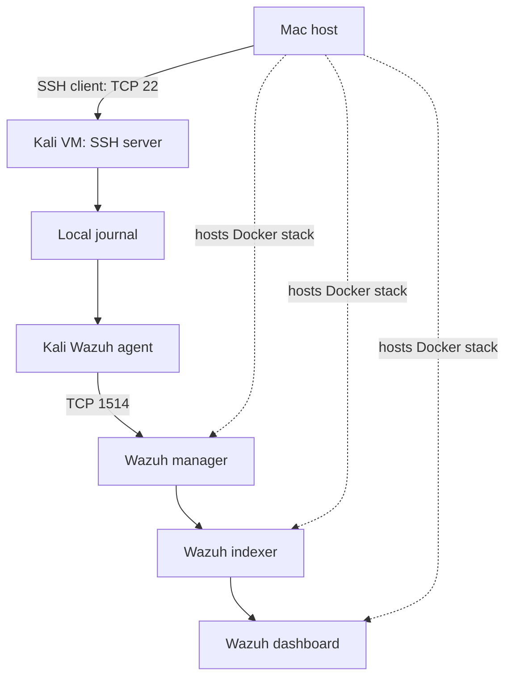
```mermaid
flowchart TD
    M[Mac host] -->|SSH client: TCP 22| K[Kali VM: SSH server]
    K --> J[Local journal]
    J --> A[Kali Wazuh agent]
    A -->|TCP 1514| W[Wazuh manager]
    W --> I[Wazuh indexer]
    I --> D[Wazuh dashboard]
    M -. hosts Docker stack .-> W
    M -. hosts Docker stack .-> I
    M -. hosts Docker stack .-> D
```

During the recorded tests, the Mac used `172.20.10.2` and Kali used `172.20.10.5/28`. These are historical lab addresses and may change. The Mac hosting Wazuh does not mean macOS endpoint logs were collected by a Mac agent; no Mac agent was installed in this exercise.

## Tools and their roles

| Tool | What I used it for |
|---|---|
| UTM | Running Kali on my Mac |
| Kali Linux and OpenSSH | Generating and inspecting controlled authentication activity |
| Splunk Enterprise and SPL | Searching and investigating indexed events |
| Splunk Universal Forwarder | Transporting Kali logs to Splunk |
| Wazuh | Processing and reviewing authentication and sudo events |
| Docker | Hosting the Wazuh single-node environment |
| `journalctl`, `tail`, `grep` | Examining and filtering local evidence |
| Netcat and Nmap | Checking receiver reachability and SSH service exposure |
| GitHub | Keeping the investigation, screenshots, and lessons together |

## Phase 1: Splunk

### 1. Prepare the Kali endpoint

I checked the endpoint hostname and network configuration before testing the monitoring path. `hostname` identifies the machine; `ip addr` lists its interfaces and addresses.

```bash
hostname
ip addr
```

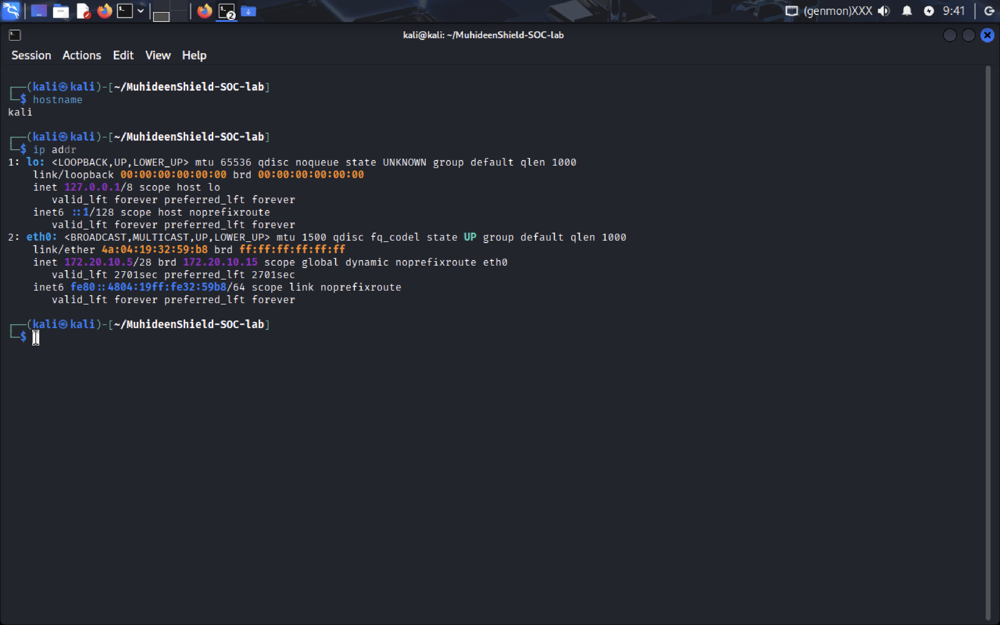

This identifies the lab endpoint and its recorded network configuration. An IP address alone does not identify the person using a machine.

### 2. Verify Splunk and its receiver

On the Mac, I checked the Splunk processes:

```bash
/Applications/Splunk/bin/splunk status
```

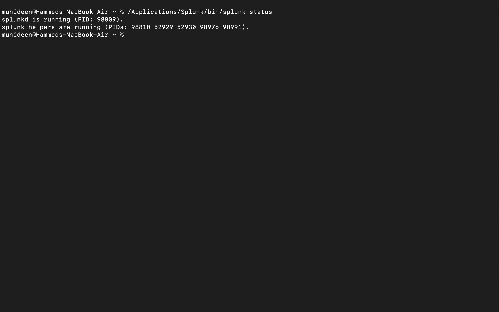

I inspected the effective receiver configuration. `btool` lists Splunk configuration; `--debug` includes configuration-file origins. The filter shows the receiver stanza and ten following lines.

```bash
/Applications/Splunk/bin/splunk btool inputs list --debug | grep -A 10 '\[splunktcp'
```

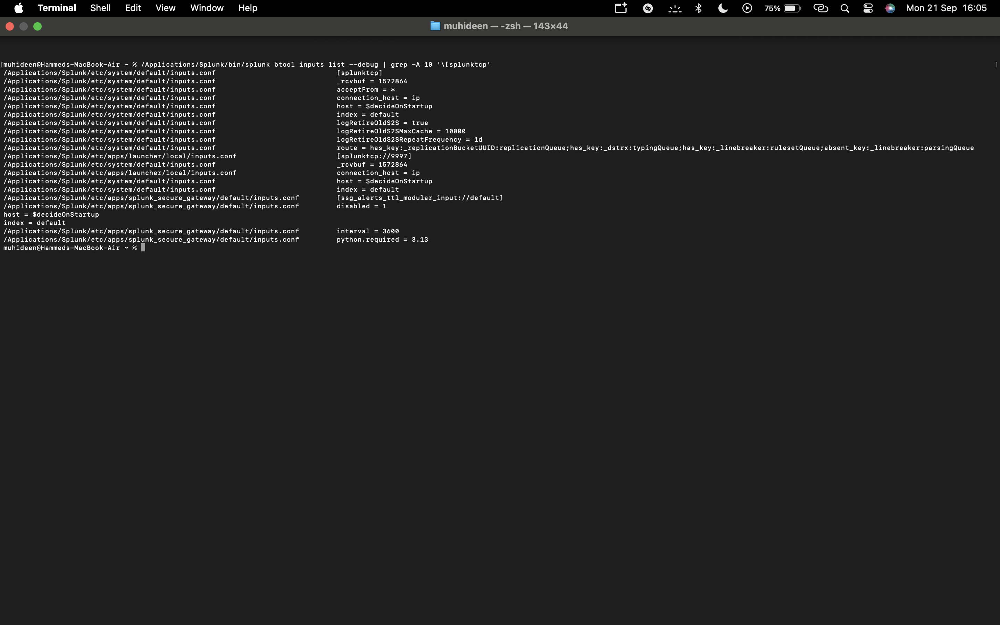

The `[splunktcp://9997]` stanza establishes that a receiving input is configured. I checked network reachability separately.

### 3. Verify connectivity and forwarding

From Kali, I tested a connection to the receiver. Netcat's `-v` gives verbose output; `-z` checks connectivity without sending application data.

```bash
nc -vz 172.20.10.2 9997
```

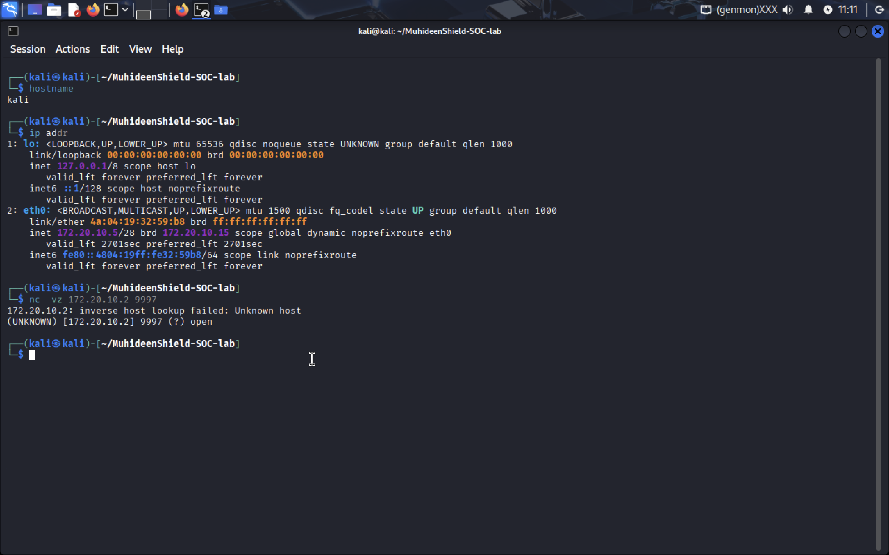

The port reported `open`. A reverse-name lookup warning did not prevent the TCP connection.

Next, I asked the Universal Forwarder to list its forwarding destinations:

```bash
sudo /opt/splunkforwarder/bin/splunk list forward-server
```

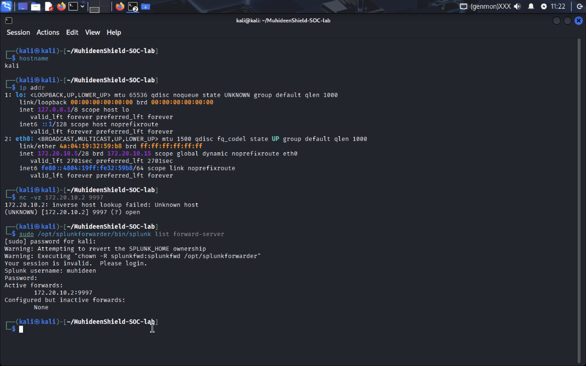

The destination `172.20.10.2:9997` appeared under active forwards. This establishes a forwarding connection; the event search below checks whether the specific authentication data arrived.

### 4. Generate controlled SSH activity

I started the SSH service on Kali using `sudo systemctl start ssh`. I checked local ports with the following SYN scan, which requires elevated privileges. `-sS` selects that scan type and `-p` lists the ports.

```bash
sudo nmap -sS -p 22,80,443 localhost
```

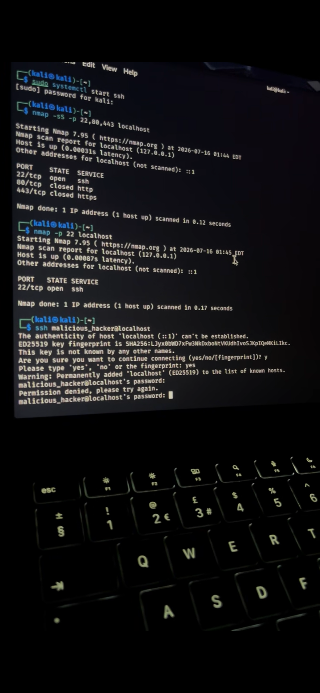

I then attempted a login with a deliberately invalid username:

```bash
ssh malicious_hacker@localhost
```

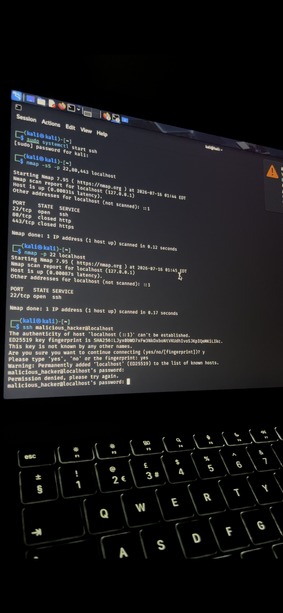

Here, `localhost` means Kali itself: the initial test used Kali as both client and server. The username is a test label, not attribution to an attacker.

I inspected the authentication log with `sudo tail -n 20 /var/log/auth.log`, which prints its last 20 lines.

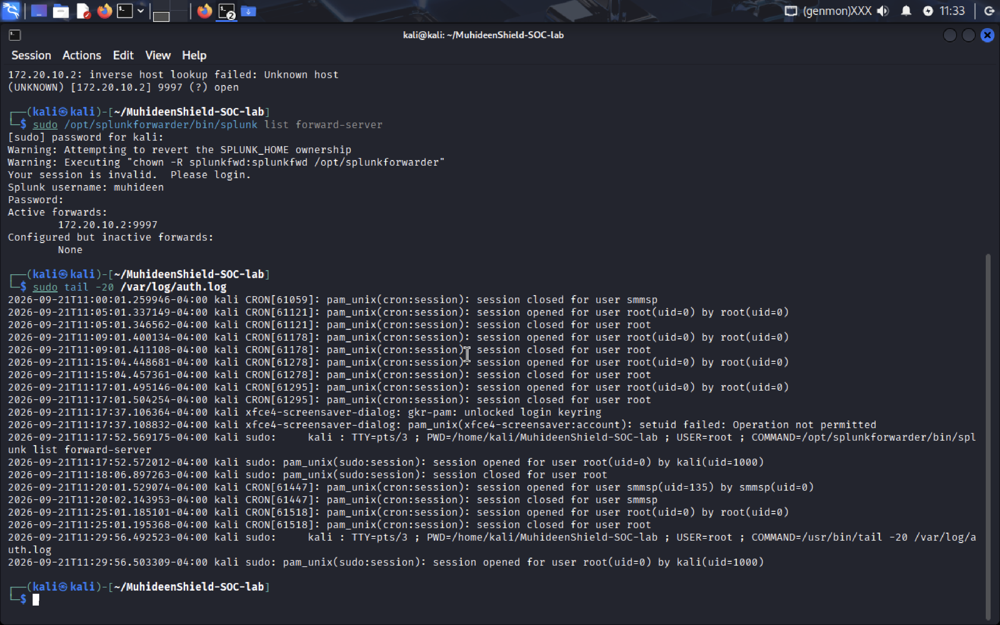

### 5. Find and investigate the events

In Splunk, I searched accessible indexes for the test username:

```spl
index=* "malicious_hacker"
```

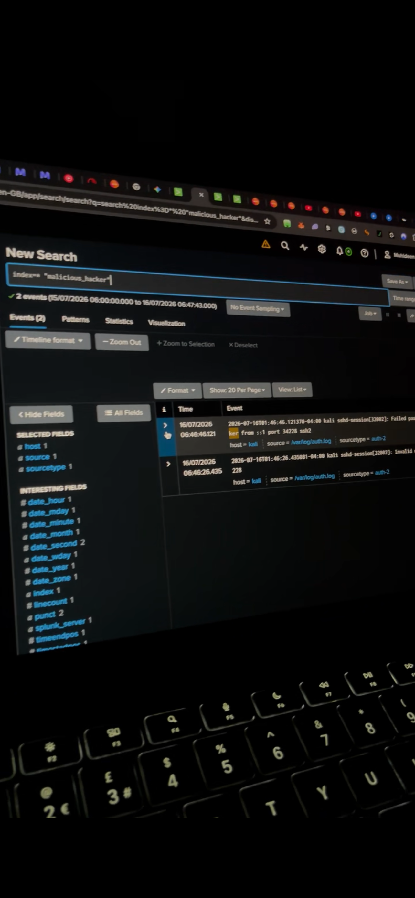

The documented event metadata included `host=kali`, `source=/var/log/auth.log`, and `sourcetype=auth-2`.

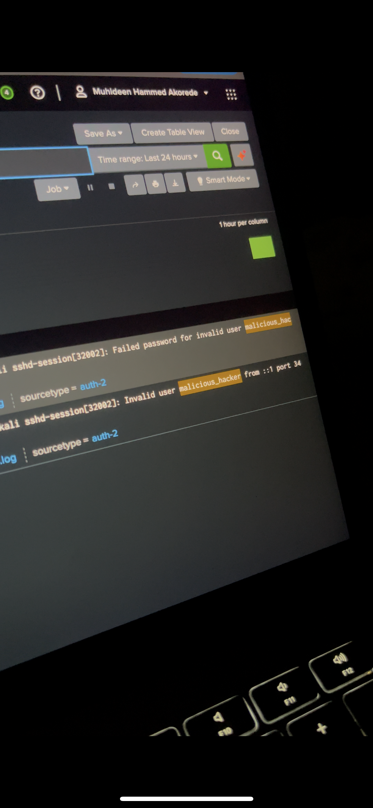

The investigation identified `Invalid user malicious_hacker` and `Failed password for invalid user malicious_hacker`. Together with the source metadata, this demonstrated the path from generated activity to searchable Kali authentication events.

**Assessment:** This was expected lab activity. A failed login alone does not establish an attack. In a real investigation I would consider the account, source, frequency, timing, later success, and endpoint activity before escalating. This search was not a validated automated brute-force rule.

Earlier general Splunk search screenshots are preserved in the [Splunk gallery](screenshots/02-splunk/README.md). Their Mac/Splunk internal events should not be used as evidence of Kali authentication ingestion; the dedicated authentication screenshots above support that result.

### Splunk limitation

The original walkthrough records the expiry of the Enterprise licence and preservation of earlier evidence. This page makes no claim about the currently active licence or alerting capability. Search results, forwarder status, and receiver reachability establish different parts of the lab and should be interpreted separately.

## Phase 2: Wazuh

### 1. Deploy the environment and enroll Kali

I extended the lab with a Wazuh single-node Docker deployment on the Mac and a Wazuh agent on Kali. The recorded manager, indexer, and dashboard images after recovery were tagged **4.14.7**, and the Kali agent package was **4.14.7-1**. Earlier notes referred to repository branch `4.14.10`; a branch name does not establish the running image version.

<details>
<summary>Before enrollment: dashboard evidence</summary>

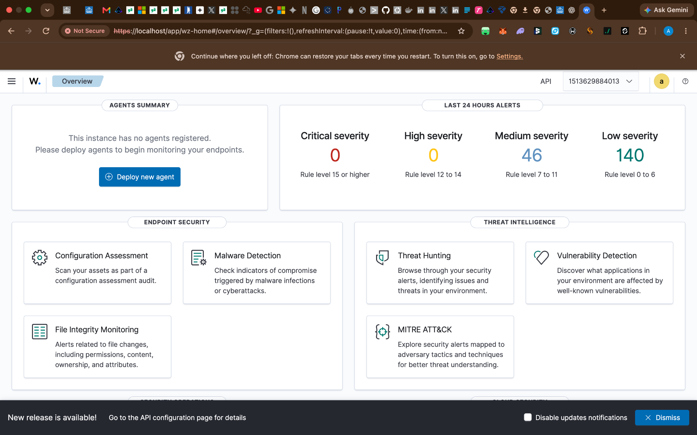

</details>

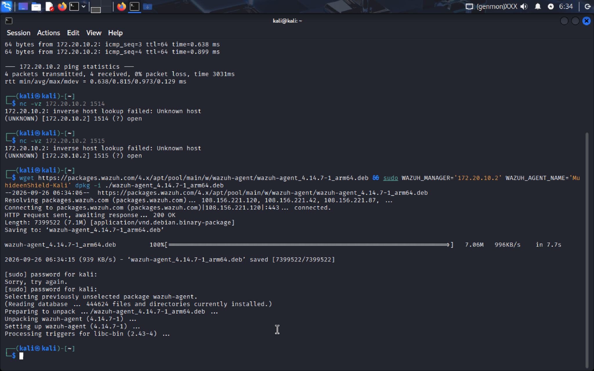

Connectivity checks to manager ports 1514 and 1515 reported open. The installation specified manager `172.20.10.2` and agent name `MuhideenShield-Kali`.

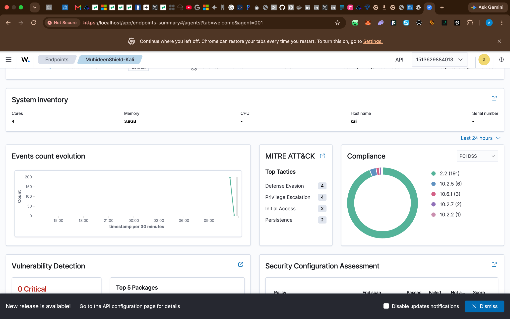

The endpoint dashboard recorded agent `001`. Tactic counts shown by a security dashboard are rule classifications; they are not proof of actual attacks.

### 2. Check the collection source

On Kali, I inspected Wazuh's local-file blocks. `grep -A 6` prints each matching line and six following lines.

```bash
sudo grep -A 6 '<localfile>' /var/ossec/etc/ossec.conf
```

The demonstrated source included:

```xml
<localfile>
  <log_format>journald</log_format>
  <location>journald</location>
</localfile>
```

Wazuh's demonstrated input was the system journal. `/var/log/auth.log` was inspected separately; it should not be described as the direct Wazuh input verified here. Other collection blocks existed, but every configured source was not tested.

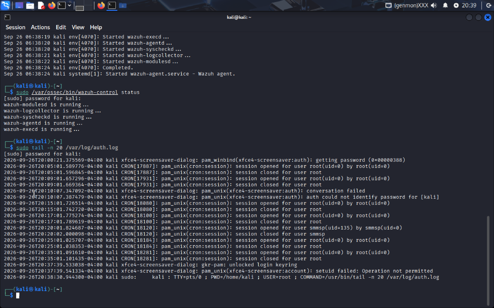

### 3. Review authentication failures and success

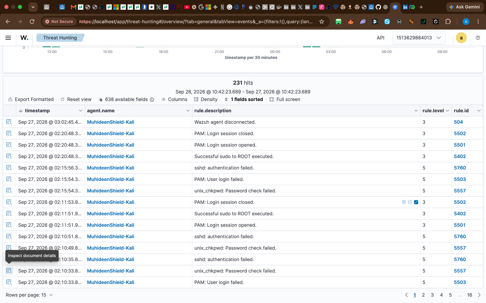

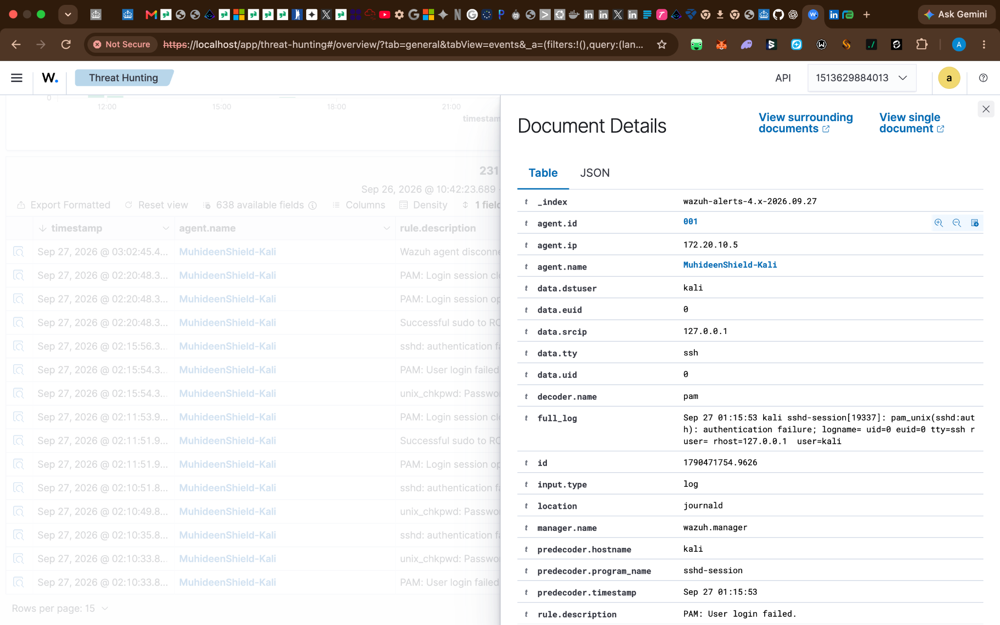

A single authentication attempt can generate both password and PAM messages. Counting every related row as a separate attempt would overstate the number of attempts.

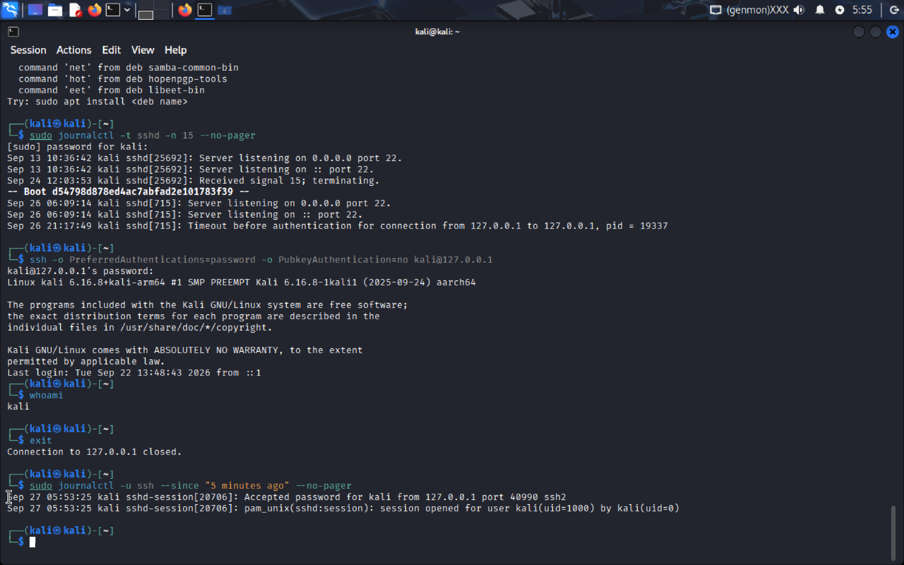

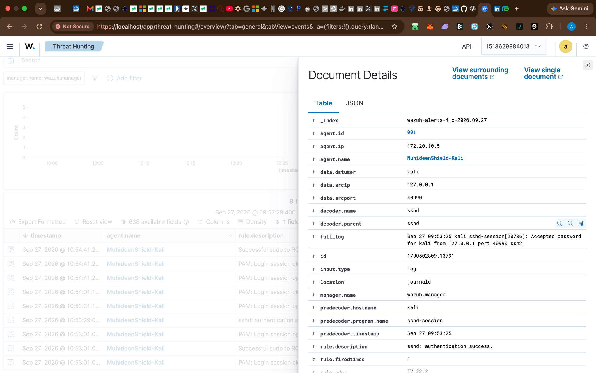

The successful event matched account `kali`, source `127.0.0.1`, source port `40990`, and process `20706`. This was a loopback test. Displayed timestamps differed across views, so they must be normalized before building a time-based correlation. The earlier failures and this success were hours apart, not a validated rapid brute-force sequence.

### 4. Review privileged activity

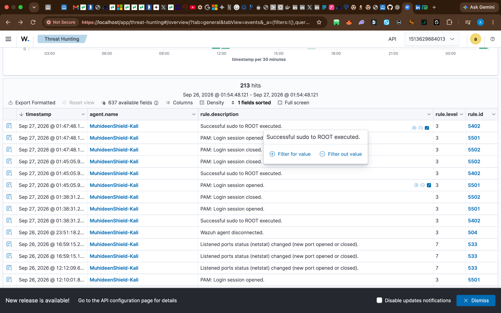

I compared local sudo records with Wazuh `full_log`. A sudo record with `USER=root` means the command executed as root; it does not mean the SSH login account was root. The next section contains the separate Mac-to-Kali investigation, its timeline, and its evidence gaps.

## SSH and sudo investigation

**Period:** September 26–30, 2026. **Classification:** Authorized lab activity. **Status:** September 29 workflow verified; September 30 Mac-origin failure/success comparison unfinished.

### Objective

Follow authentication activity from a Linux endpoint into Wazuh, distinguish login identity from command execution identity, and build an evidence-based timeline. This is a practice investigation, not a report of a real intrusion.

### Initial loopback tests, September 26–27

Kali initially acted as both SSH client and server. Password authentication was tested with:

```bash
ssh -o PreferredAuthentications=password -o PubkeyAuthentication=no kali@127.0.0.1
```

Local records showed failed passwords at September 26 21:10:36 and 21:10:51 from port `56132`, and 21:15:55 from port `37460`. These are original displayed local times, before the timezone correction. Wazuh showed three failed-password rows and related PAM events. Several messages can describe one authentication attempt, so PAM and password messages must not be counted as separate attempts automatically.

The logs also contained `pam_winbind` availability errors. Those errors were not diagnosed or fixed. Authentication records appeared under `sshd-session`, so filtering only the `sshd` tag initially missed them.

A later successful loopback event contained:

```text
Accepted password for kali from 127.0.0.1 port 40990 ssh2
```

The Wazuh screenshot matched process `20706`, account `kali`, source `127.0.0.1`, and source port `40990`. The terminal displayed September 27 05:53:25, while Wazuh raw text and dashboard displayed different hours. These times must not be combined without timezone normalization. The failures and success were hours apart; this did not validate rapid brute-force correlation.

### Mac-to-Kali investigation, September 29

The Mac initiated SSH to `kali@172.20.10.5`. Within that session:

```bash
echo "$SSH_CONNECTION"
```

returned:

```text
172.20.10.2 51080 172.20.10.5 22
```

The fields identify client IP, client port, server IP, and server port. The source port is temporary; port 22 is the server's listening port. The matching accepted-password event was confirmed in Wazuh by the lab operator, but its exact timestamp was not copied into the session notes.

| Time, September 29 | Activity | Verification |
|---|---|---|
| Exact login time not captured | `kali` authenticated from `172.20.10.2:51080` | Session output and user-confirmed Wazuh match |
| 16:08:50, Kali displayed time | `sudo whoami`, process `5572`, `TTY=pts/1` | Pasted journal record and user-confirmed Wazuh match |
| 16:10:26, Kali displayed time | Sudo used to read the journal | Pasted journal record |
| 17:06:38, Kali displayed time | Client disconnected, SSH session closed | Pasted local record; Wazuh match confirmed the next day |

#### Privileged command evidence

```text
Sep 29 16:08:50 kali sudo[5572]: kali : TTY=pts/1 ; PWD=/home/kali ; USER=root ; COMMAND=/usr/bin/whoami
Sep 29 16:08:50 kali sudo[5572]: pam_unix(sudo:session): session opened for user root(uid=0) by kali(uid=1000)
Sep 29 16:08:50 kali sudo[5572]: pam_unix(sudo:session): session closed for user root
```

`kali` requested the command; `root` was its execution identity. This does not show an SSH login as root. The terminal outputs were `kali` for `whoami` and `root` for `sudo whoami`. The ordinary SSH shell remained under `kali`.

The `tty` command returned `/dev/pts/1`, supporting the connection between the current terminal and sudo record. Terminal numbers can be reused; this is supporting context, not an immutable historical session identifier. The sudo record names the invoked command, not its output or every command executed in the shell.

#### Logout evidence

```text
Sep 29 17:06:38 kali sshd-session[5103]: Received disconnect from 172.20.10.2 port 51080:11: disconnected by user
Sep 29 17:06:38 kali sshd-session[5095]: syslogin_perform_logout: logout() returned an error
Sep 29 17:06:38 kali sshd-session[5103]: Disconnected from user kali 172.20.10.2 port 51080
Sep 29 17:06:38 kali sshd-session[5095]: pam_unix(sshd:session): session closed for user kali
```

The source IP and port match the earlier session. The logout bookkeeping error was observed but not diagnosed; separate records explicitly show disconnection and PAM session closure. The SSH closure is different from the sudo session closing after a command.

### September 30: checking the actual source

The new exercise intended one wrong password from the Mac, followed later by a correct login. The screenshot instead showed:

```text
Sep 30 15:32:36 kali sshd-session[19648]: Failed password for kali from 172.20.10.5 port 52286 ssh2
```

The source matched Kali's own address. Running `hostname` in the originating terminal returned `kali`, confirming that commands were executing on Kali. A new Mac Terminal tab returned `Hammeds-MacBook-Air.local`.

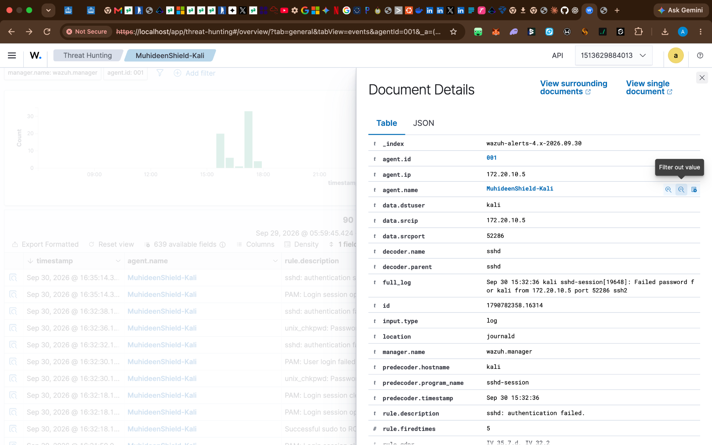

The raw event timestamp was 15:32:36; the dashboard list displayed events around 16:32. The one-hour difference has not been fully investigated, so the raw time is retained without an assumed timezone conversion.

The corrected Mac-origin failure test was instructed, but its result was not supplied before documentation began. A subsequent successful Mac login for this exercise has also not been validated. Neither a completed failure-to-success sequence nor an automated correlation detection is claimed for September 30.

### Analyst assessment

The tested activity was expected because I generated it and verified its context. Successful authentication establishes that credentials were accepted, not that the rightful owner used them. A failed password alone does not establish compromise; its significance depends on the account, source, timing, frequency, and surrounding behavior.

In production, I would check time-specific DHCP/VPN mappings, asset ownership, account-owner confirmation, and endpoint activity. A private source IP cannot be attributed to a person using public geolocation. Those enterprise evidence sources were discussed conceptually, not deployed in this lab.

### Remaining evidence gaps

- Capture the exact September 29 accepted-login timestamp with its timezone.
- Verify the new Mac-origin failed and successful login records.
- Normalize raw event time versus dashboard display time.
- Test and document custom correlation logic separately before claiming detection validation.
- Expand post-login telemetry; current sudo evidence is not full command or process auditing.

## Problems and recovery

### Splunk connectivity and log checks

I checked the receiver configuration, TCP reachability, active forwarding destination, local authentication log, and matching Splunk events separately. This helped distinguish a network connection from successful ingestion of a particular event. The phase 1 screenshots above show those stages.

### 1. Docker and dashboard unresponsive — September 29

**Symptoms:** The dashboard stopped loading. `docker compose ps -a` hung in the single-node directory, and `docker info` displayed client information before stalling at the server section. Commands were cancelled with Control+C. Docker Desktop showed its engine running but an empty container list.

**Checks:** `docker context ls` responded and identified `desktop-linux` as active. An OrbStack context also existed; this did not establish a conflict. Quitting and reopening Docker Desktop did not resolve the issue.

**Recovery:** After saving work and shutting down Kali normally, the Mac was restarted. Docker Desktop was opened, then `docker ps -a` returned the manager, indexer, and dashboard containers as running. The dashboard at `https://localhost` loaded again. Kali was started, the agent was checked, and a fresh `sudo whoami` event was located in Wazuh.

**Result:** Service and fresh ingestion restored. The root cause was not established. No factory reset, volume purge, or data deletion was used. Neither memory exhaustion nor an OrbStack conflict was proven.

Docker resource allocation had previously been reduced from 6 GB to 4 GB on an 8 GB Mac. This is configuration context, not proof of the outage cause.

### 2. Timezone name rejected

`Africa/lagos` was rejected as invalid. Correcting the case to `Africa/Lagos` worked:

```bash
sudo timedatectl set-timezone Africa/Lagos
```

This sets the display timezone. It does not by itself verify clock synchronization with a time source.

### 3. SSH events missed by a filter

An early `journalctl -t sshd` query showed listener messages but missed authentication records tagged `sshd-session`. Later, queries using `-u ssh` and 10- and 30-minute windows returned no entries for the logout. A broader search found the records:

```bash
sudo journalctl --since "15 minutes ago" --no-pager | grep -Ei 'sshd|51080'
```

The evidence was present outside the results of the narrower filter. The exact systemd unit association was not investigated. Broaden the query when a filter returns no results; do not immediately conclude that the activity never occurred.

### 4. Agent running, but recent dashboard activity uncertain

The dashboard's most recent observed item was around 16:40 and was described as a disconnect. The agent service was still `active (running)`.

```bash
sudo tail -n 40 /var/ossec/logs/ossec.log
sudo cat /var/ossec/var/run/wazuh-agentd.state
```

The log contained old TCP 1514 and enrollment TCP 1515 errors, followed by `Connected to the server` and `Agent is now online`. The state file reported:

```text
status='connected'
last_keepalive='2026-09-29 12:27:04'
last_ack='2026-09-29 12:27:04'
msg_buffer='0'
```

The local clock displayed current Lagos time, approximately 17:27. A retained process timezone was suspected. After restarting the agent:

```bash
sudo systemctl restart wazuh-agent
sudo cat /var/ossec/var/run/wazuh-agentd.state
```

the output included:

```text
status='connected'
last_keepalive='2026-09-29 17:29:23'
last_ack='2026-09-29 17:29:23'
msg_buffer='0'
```

A new `sudo whoami` event appeared in Wazuh with the expected current time. The September 29 SSH closure was subsequently confirmed in Wazuh on September 30.

**Verified:** Restart corrected the displayed agent timestamps and a fresh event reached the dashboard. **Unresolved:** The original reason the earlier closure was not visible, and whether it was delayed, outside the searched window, or missed during inspection. We did not establish event loss or that the timezone difference caused an ingestion failure.

### 5. Wrong terminal context — September 30

The failed-login source was `172.20.10.5`, not the expected Mac address `.2`. `hostname` returned `kali`. Opening a new Mac Terminal tab and checking `hostname` returned the Mac hostname. An SSH terminal displayed on a Mac still executes commands on the remote system. The corrected test remains pending.

### Monitoring checks are different

| Check | What it establishes |
|---|---|
| Service active | A process is running |
| Agent connected / recent acknowledgement | Agent-manager communication is established |
| Empty agent buffer | No events currently waiting in that buffer |
| Matching fresh event in dashboard | That specific event completed the collection and indexing path |

None of these alone proves every expected log source is collected without loss.

### Updated Docker screenshot — October 6, 2026

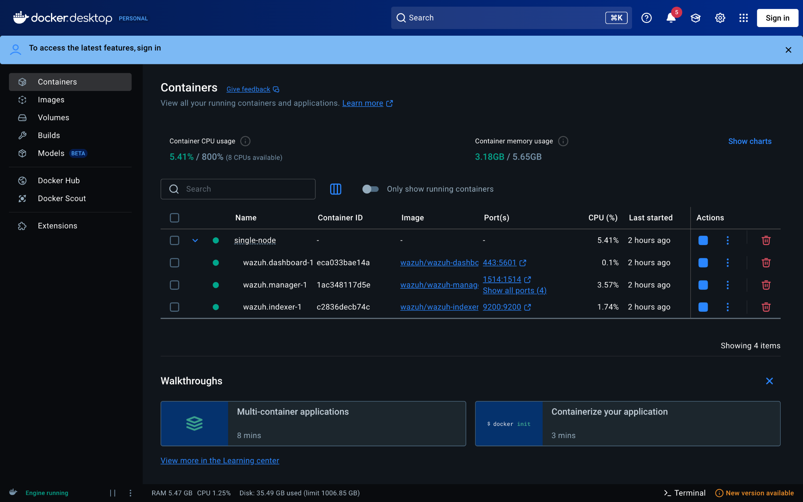

This October 6 capture shows Docker's engine running and the expanded `single-node` project with `wazuh.dashboard-1`, `wazuh.manager-1`, and `wazuh.indexer-1` displaying running indicators. The visible mappings include dashboard `443:5601`, manager `1514:1514`, and indexer `9200:9200`.

This replaces the older Docker screenshots. It records the container state at this capture; the September 29 troubleshooting account above remains a historical record. Running containers alone do not prove dashboard accessibility, agent connectivity, or fresh event ingestion.

## Commands explained

<details>
<summary>Expand the command reference: environment, SSH, logs, agent, and Docker checks</summary>

These commands document the lab workflow; run them in the stated environment. IPs, time windows, process IDs, and source ports must be adjusted to the event being investigated.

### Identify the shell before generating traffic

```bash
hostname
whoami
```

`hostname` identifies the computer executing commands. `whoami` identifies the command's effective user. A Mac Terminal tab with an SSH session can return `kali` because execution is remote.

On Mac, Command+T opens another Terminal tab. `ifconfig` displays interface addresses; a local `inet 172.20.10.2` line was checked against the SSH source. This only establishes the current address, not its historical owner.

### Connect from the local Mac shell

```bash
ssh kali@172.20.10.5
```

`ssh` establishes an encrypted connection; `kali` is the destination account, and the address identifies the server. Do not append the network prefix `/28` to the SSH destination.

For the controlled password test:

```bash
ssh -o PreferredAuthentications=password -o PubkeyAuthentication=no kali@172.20.10.5
```

`-o` supplies an SSH option. These options select password authentication and disable public-key authentication for that connection. The exercise instructed one incorrect password, then Control+C at the next prompt. No automated password guessing was performed.

Within an established SSH session:

```bash
echo "$SSH_CONNECTION"
tty
```

`echo` displays the SSH connection variable: client IP, client port, server IP, server port. `tty` displays the current terminal, such as `/dev/pts/1`.

```bash
sudo whoami
exit
```

`sudo` runs the specified command as root by default, subject to account permissions. It does not bypass authorization or permanently change an ordinary shell's identity. `exit` closes the current shell; in our SSH session this returned the terminal to the Mac prompt.

### Read Kali logs

```bash
sudo tail -n 20 /var/log/auth.log
sudo journalctl -t sudo -n 10 --no-pager
sudo journalctl -u ssh --since "10 minutes ago" --no-pager
```

- `tail -n 20`: last 20 lines of a file.
- `journalctl`: reads the system journal.
- `-t sudo`: filters by syslog identifier/tag.
- `-n 10`: limits output to 10 recent entries.
- `-u ssh`: filters by service unit; some relevant records were missed by this filter in the lab.
- `--since`: limits the time window.
- `--no-pager`: prints without an interactive pager.

When a narrow query missed SSH evidence:

```bash
sudo journalctl --since "15 minutes ago" --no-pager | grep -Ei 'sshd|51080'
```

The pipe sends output into `grep`. `-E` enables the alternative pattern `|`; `-i` ignores letter case. The search keeps lines containing `sshd` or the specific source port. A source port is meaningful together with addresses and time, not as a globally unique session ID.

### Check the agent on Kali

```bash
sudo systemctl status wazuh-agent --no-pager
sudo tail -n 40 /var/ossec/logs/ossec.log
sudo cat /var/ossec/var/run/wazuh-agentd.state
```

These check service status, recent internal messages, and the agent state file. `cat` prints a file. Inspect the latest successful messages as well as errors. In this lab, restarting the agent corrected its displayed timezone:

```bash
sudo systemctl restart wazuh-agent
```

This interrupts monitoring briefly; it was followed by connection and fresh-event verification.

### Check the Docker host on Mac

```bash
cd /Users/muhideen/wazuh-docker/single-node
docker compose ps -a
docker context ls
docker info
docker ps -a
```

`cd` changes directories. Compose lists containers for the project; `docker ps -a` lists all containers, including stopped ones. Contexts identify Docker endpoints. `docker info` queries client/server information. A hung server query is different from a successful query showing stopped containers.

### Inspect Wazuh evidence

Select the Kali agent, use an appropriate time range, refresh results, and expand `full_log`. Compare account, source IP, source port, process ID, and event time with the original record. For yesterday's events, use an absolute date range instead of a short rolling window. Record raw timestamp and dashboard timezone separately when they differ.

</details>

## Lessons and next steps

### Technical lessons

- SSH connects a client to a server. Roles apply to a connection: Kali can connect to itself, or the Mac can initiate a connection to Kali.
- `127.0.0.1` means loopback. Connecting to Kali's own interface address can also produce Kali-to-Kali traffic.
- `agent.ip` identifies the monitored endpoint; `data.srcip` identifies the source extracted from the event. They answer different questions.
- A terminal window's physical location does not determine where commands execute. Check `hostname`.
- `USER=root` in a sudo record identifies the target execution account; it does not establish an SSH login as root.
- Sudo session closure and SSH session closure are distinct events.
- One authentication attempt can generate several messages. Count the appropriate events, not every related PAM line.
- Process running, agent connected, and event searchable are separate validation stages.
- Timezones, query filters, and time windows can hide relevant evidence.

### Analyst reasoning

Successful authentication does not establish legitimacy. Failed authentication does not automatically establish an attack. I practised checking account, source, time, sequence, expected activity, and user confirmation before drawing a conclusion.

In an organization, staff devices do not send logs simply because they join Wi-Fi. The team configures agents or other collection methods, network access, and log sources. Device logs, network logs, and identity logs provide different visibility. DHCP lease history can help map an IP to a device at the event time; inventory and endpoint records can help identify its assigned owner or active user. Ownership alone does not prove who initiated an action.

Those enterprise workflows were discussed, not implemented. No staff monitoring, corporate network collection, Mac agent installation, or EDR deployment was completed here.

### Learning approach

I practised explaining command options, predicting outputs, comparing raw logs with parsed fields, and correcting an incorrect interpretation of sudo. Guided execution is part of this learning record. My next goal is to repeat a small investigation independently and explain what each piece of evidence proves and what remains uncertain.

### Next work

1. Finish the Mac-origin failed-password test and subsequent successful login.
2. Build a timestamped comparison using actual records and confirmed timezones.
3. Write a short triage assessment with evidence, alternative explanations, and gaps.
4. Implement and validate a custom detection separately; choose and test any thresholds explicitly.
5. Add another telemetry source only after the current investigation is understood.

Private lab IPs and terminal IDs are useful practice evidence; they are not permanent device or person identifiers.

## Supporting documentation

The walkthrough above brings the project story together. These pages provide focused references and the complete screenshot galleries.

| Reference | Contents |
|---|---|
| [Network architecture](documentation/02-networking/network-architecture.md) | Original Kali/Splunk network configuration |
| [Splunk setup](documentation/03-splunk/splunk-setup.md) | Receiver, connectivity, forwarding, and earlier analysis |
| [Splunk investigation](documentation/05-log-analysis/ssh-failed-login-investigation.md) | Controlled invalid-user SSH test and findings |
| [Wazuh environment](documentation/06-wazuh/README.md) | Deployment, collection source, and validation scope |
| [SSH and sudo case study](incidents/2026-09-26-30-wazuh-ssh-sudo.md) | Timeline, interpretation, and remaining evidence gaps |
| [Troubleshooting](documentation/06-wazuh/troubleshooting.md) | Symptoms, checks, recovery, and unresolved causes |
| [Command reference](documentation/06-wazuh/commands.md) | Commands and option explanations |
| [Lessons](lessons-learned/wazuh-authentication-lab.md) | Technical and analytical learning |
| [Detection status](detections/README.md) | Investigation search and planned rule validation |

**Screenshot galleries:** [Kali networking](screenshots/01-kali-network/README.md) · [Splunk](screenshots/02-splunk/README.md) · [Forwarder](screenshots/03-forwarder/README.md) · [Log analysis](screenshots/04-log-analysis/README.md) · [Wazuh](screenshots/05-wazuh/README.md).

The repository uses `documentation/` for technical references, `incidents/` for controlled investigation reports, `lessons-learned/` for learning records, `detections/` for detection status and future rules, and `screenshots/` for original visual evidence.

## Author

**Muhideen Hammed** — developing practical experience in SOC operations, Linux log analysis, security monitoring, and evidence-based investigation.

This is an educational defensive-security lab. All documented testing was performed on systems I own or am authorized to use.
