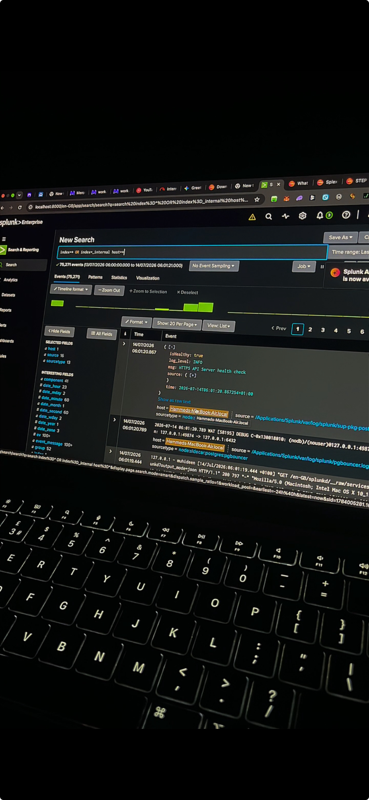
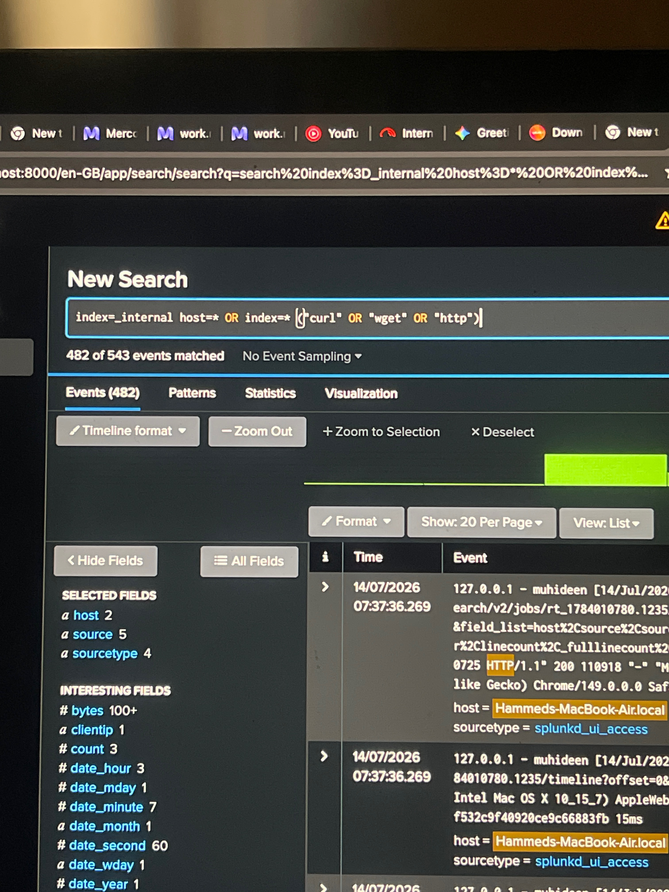

# Splunk evidence

[Return to the complete project walkthrough](../../README.md)

## Splunk status

## Kali to splunk connectivity

## Previous splunk analysis

## Splunk http command search

## Splunk receiver 9997

