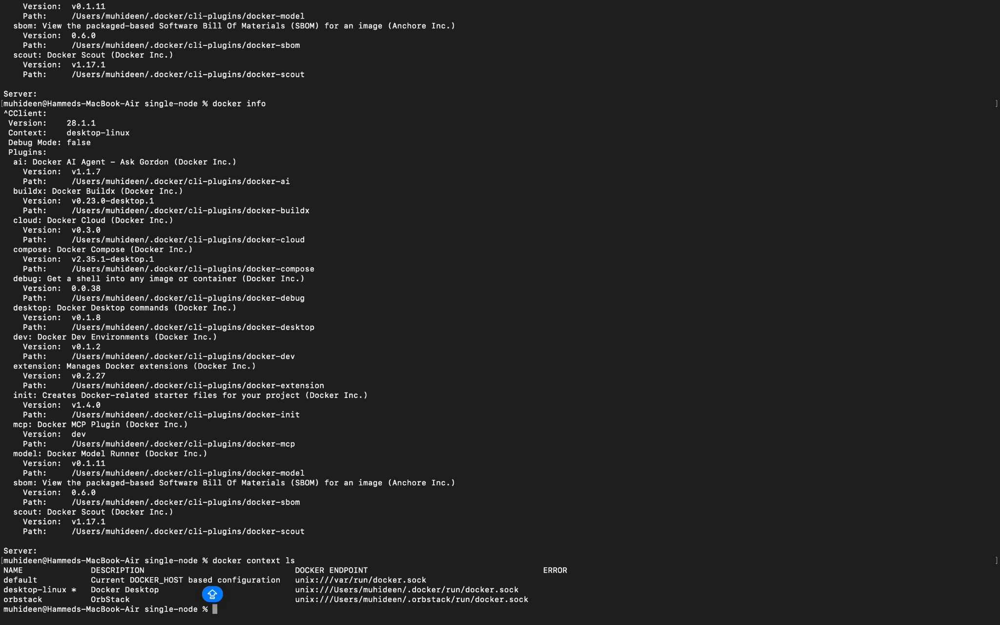
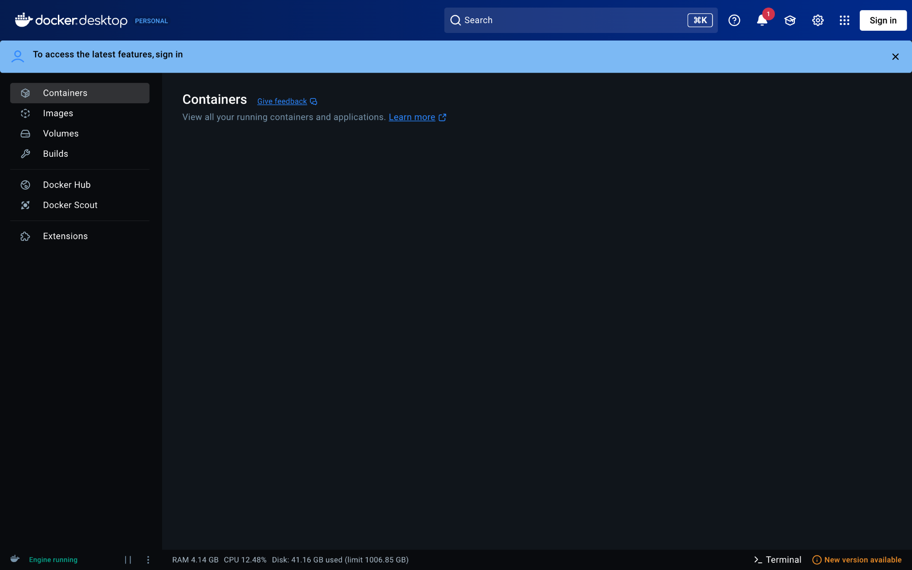
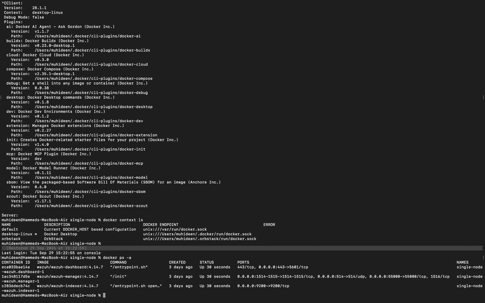

# Wazuh screenshot evidence

Original screenshots supplied during the lab, copied without image modifications. Capture times are filenames, not necessarily event times. The September 29 SSH/sudo/logout matches were reported in the conversation; no separate screenshot of those exact matches was supplied.

## Local authentication log inspection

Capture: 2026-09-27 at 01.39.28.

## Sudo event in Wazuh

Capture: 2026-09-27 at 01.54.54.

## SSH failure event list

Capture: 2026-09-27 at 10.44.46.

## Related PAM failure details

Capture: 2026-09-27 at 10.46.29.

## Successful loopback login in terminal

Capture: 2026-09-27 at 10.55.06.

## Successful loopback event in Wazuh

Capture: 2026-09-27 at 10.59.09.

## Docker context and stalled server diagnostics

Capture: 2026-09-29 at 14.52.14.

## Docker Desktop during the outage

Capture: 2026-09-29 at 14.53.55.

## Running containers after recovery

Capture: 2026-09-29 at 15.27.51.

## Failed password with Kali as source

Capture: 2026-09-30 at 16.38.34.

## Dashboard before agent enrollment

Capture: September 26, 2026 at 11.05.30.

## Manager connectivity and agent installation

Capture: September 26, 2026 at 11.34.41.

## Kali endpoint dashboard

Capture: September 26, 2026 at 12.12.56.

